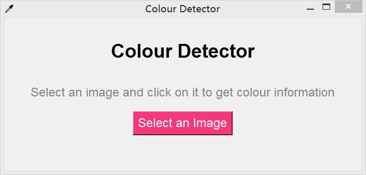
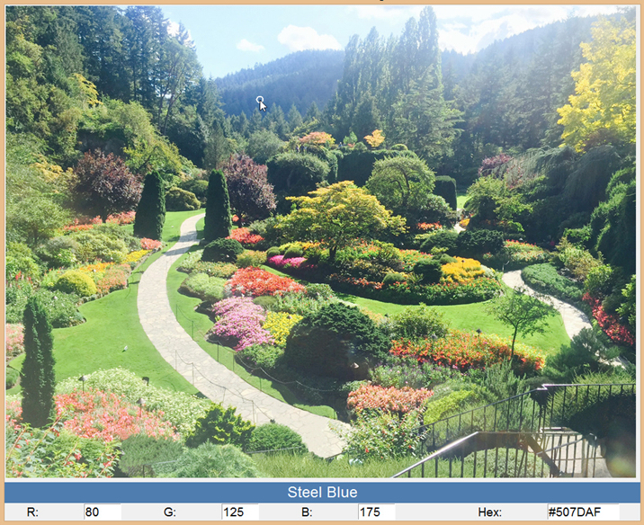
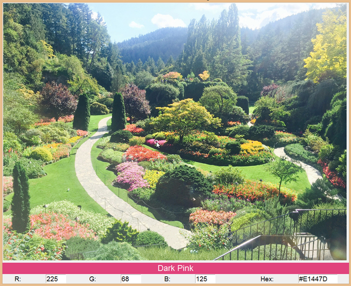

# colour-detector
This is a simple desktop user interface that displays the RGB values as well as the matched colour names of a chosen image. 

To get the colour info, click on the pink "Select an Image" button, select an image, and click on a point from which you want to retrieve the colour info. 
This interface supports png and jpg(jpeg) image files. 

Screenshots: 

